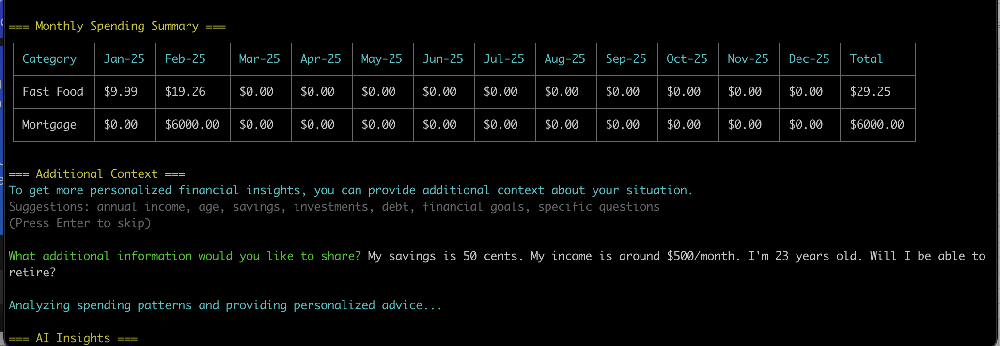

# categorAIze

Use local AI models to categorize financial transactions

Note: This is currently a minimal proof of concept work in progress. It's mainly being built by AI tools with me as a guide. 

<p align="center">
  
</p>

## Overview

Large Language Models (LLMs) can provide significant help when analyzing financial transactions. Sorting transactions into categories is important for proper accounting and tax purposes. However, sending your personal financial data to large corporations is not ideal. 

This is a node.js app which runs in tandem with a locally running model with ollama. It takes in a raw csv file (probably downloaded from a financial institution), a config file, and a list of allowable categories. The locally running llm will then use the available information as well as the existing list of transactions and their category to make a best guess on which category the new transactions should fit in. 

With all their expenses in context, users can also provide any other financial information (ie, approximate income, retirement dates, assets, etc) and ask questions about their personal financial situation. (coming soon)

Users can choose different LLMs for the underlying analysis. 

## How to Run

1. Download and install Ollama
2. Open a terminal with 2 tabs
3. In the first tab, run:
   ```bash
   ollama run llama2:latest
   ```
4. In the second tab, run:
   ```bash
   node index.js
   ```

## File Setup

- `existing.csv`: Your existing transactions that will be used as a guide
- `categories.csv`: Your allowed categories (For instance, this might sync with a tax form like the schedule C for small businesses)
- `transactions.csv`: The list of transactions that you wish to assign categories to

**Important**: Make sure to close the existing.csv file before running so that your newly categorized transactions can be appended.

## Model Selection

Note: If you want to use a different model, specify it in both:
- The ollama run command
- index.js
